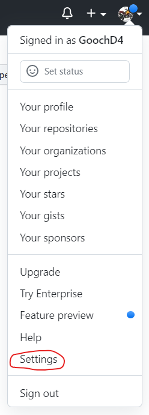
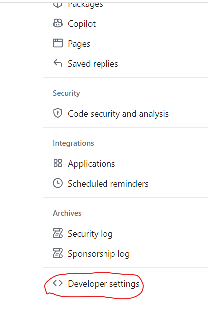
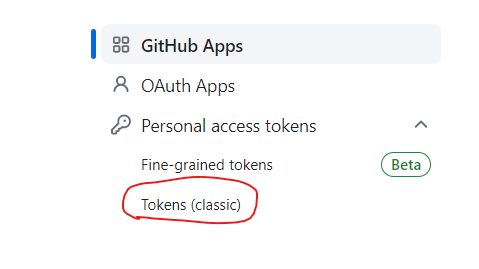
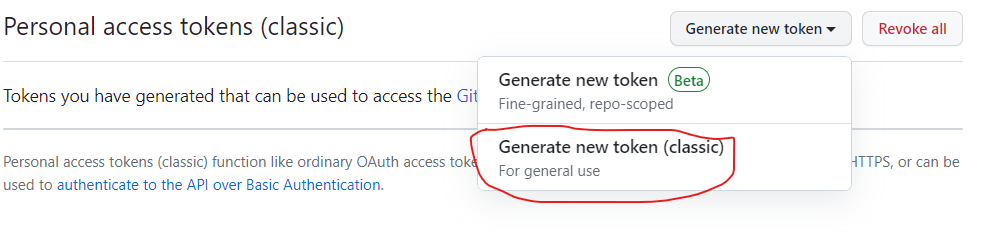
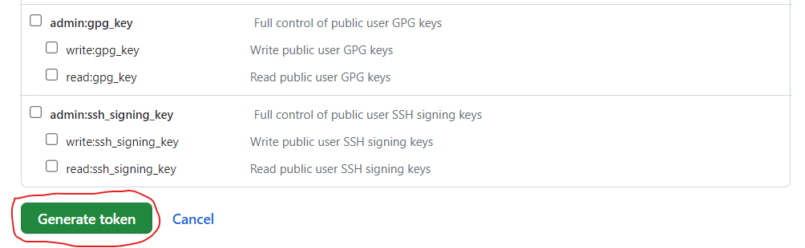
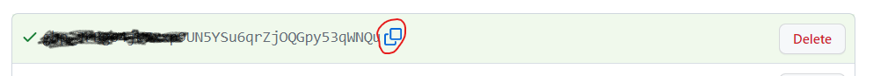

This procedure will take you through the process of creating a Github Token.  This token will authenticate you to github.com.  This is required in order to push or pull information from a tools server to github.com.

1. **From your github.com home page, click the drop down next to your profile picture on the top right of the screen and select Settings**
    

1. **On the left side of the settings screen, scroll all the way to the bottom of the list of options and select "<>Developer settings" from the menu.**
    

1. **Again on the left side of the screen click the drop down next to "Personal access tokens" and select "Tokens (classic)"**
    

1. **Click the "Generate new token box.  This will give two options.  Chose "Generate new token (classic).  You will be asked to input your password.  Do so.**
    

1. **On the following screen, add a useful note and then enable "repo", "workflow", "write:packages" and "delete:packages" by clicking on the main arrow on the top left  the box of the options and select "Generate token" at the bottom of the list.**
    

1. **On the next screen you are presented with a token.  This is the only time you will be able to copy it.  Please do so and save it in a safe place where you can access it easily.**
    

