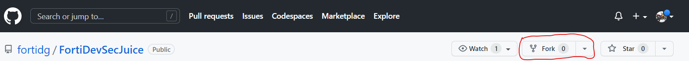
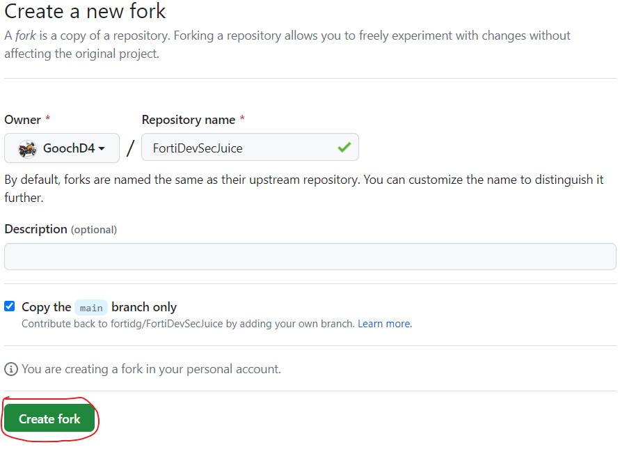

In this task, you will fork an application repository from my github.com account into your own.

1. **In your favorite browser, paste the below link into the URL bar.**

```sh
https://github.com/fortidg/FortiDevSecJuice.git

```

1. **At the top of the window, click on Fork.**
    

1. **On the following page, select "Create fork"**
    