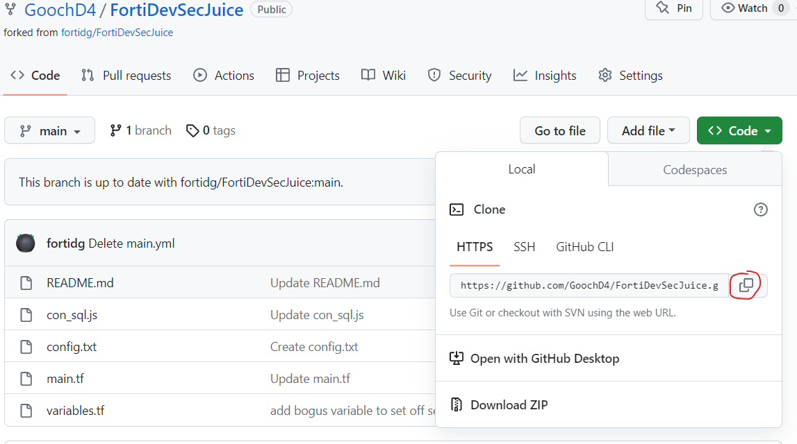
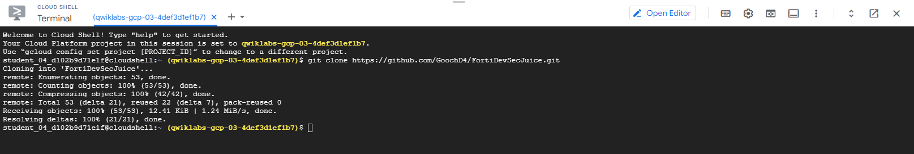

Now that you have your own copy of the repo, you can modify it as you see fit.  For this Lab, we are going to Clone the repo into the Google Cloud Shell.

1. **From your newly forked repository on Github.com, select the "<> Code" dropdown.  Click on the copy button to copy the HTTPS path to this repo.**
    

1. **Activate the GCP Cloud Shell by clicking on the cursor icon at the top right side of the Console screen.  Click Continue when asked.  This will open a cloud shell at the bottom of the screen.**
    

1. **At the cloud shell prompt, clone YOUR repository.  The below command is a**

```sh

git clone https://github.com/<your github username>/FortiDevSecJuice.git

```
The result should look something like this
    

**Congratulations!  You have finished Lab 1.  You are now ready to proceed to Lab 2.**
