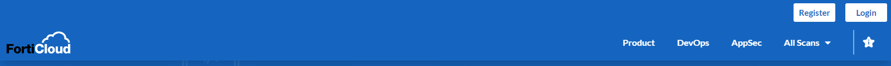
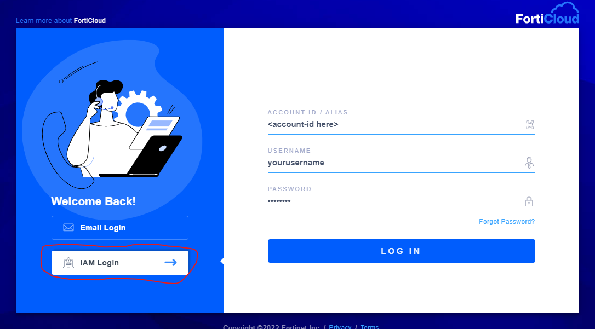
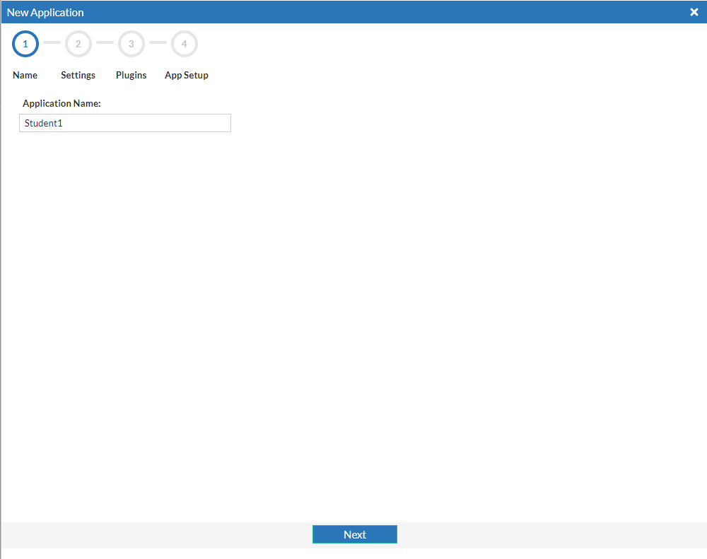
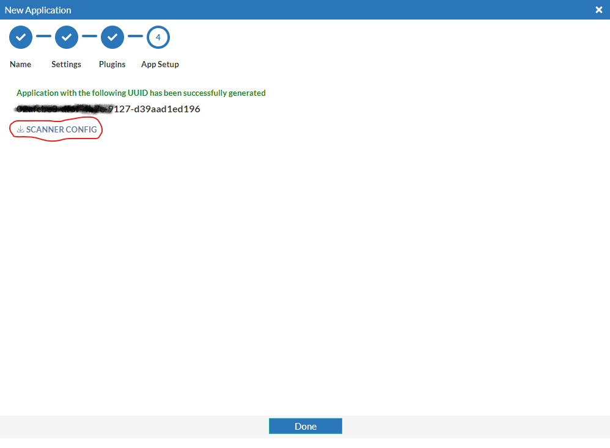
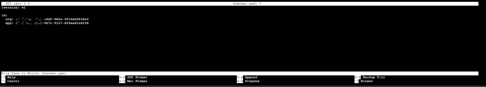
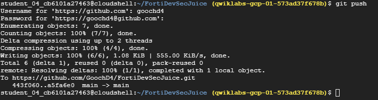
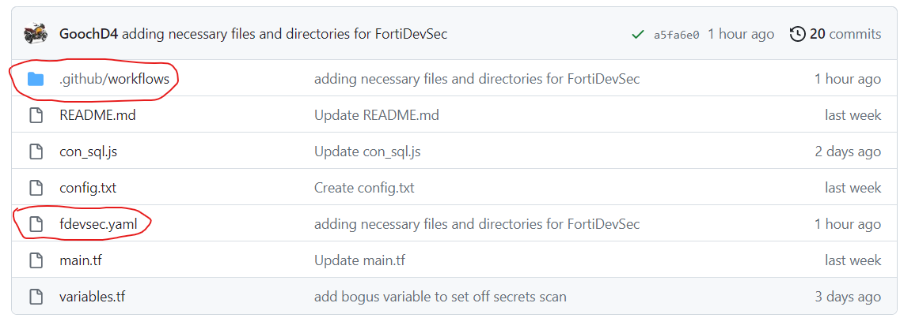
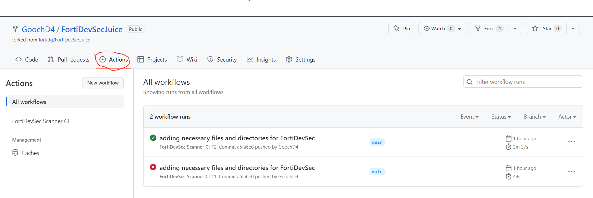
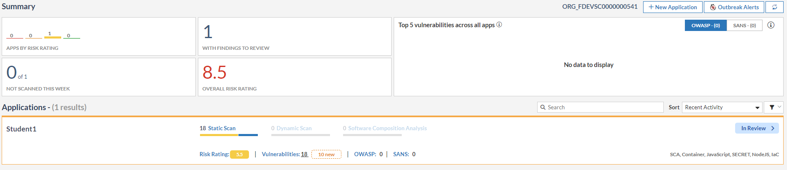
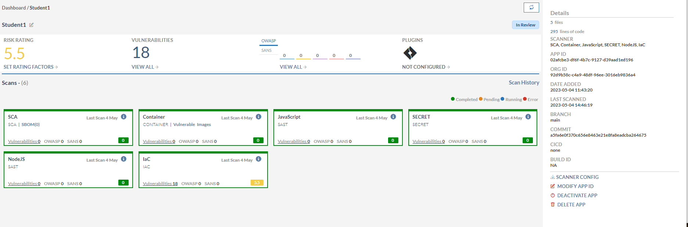

1.  **Navigate to "https://fortidevsec.forticloud.com/" and Login using your support.fortinet.com credentials.**
    

1. **Make sure that "IAM Login" is selected and input the account ID (from the original invitation email) as well as your username and password.**
    

1. **From the Summary page click on "+ New Application"**
    

1. **Input a the name of the application as "Student<x>" for step 1.  The name of the application is arbitrary, but this is a shared environment, and we need to make sure we are all working on our own application.**
    

1. **Steps 2 and 3 will be left at the default settings for the purposes of this lab.  Step 2 askes a couple of simple questiosn about the application in order to properly weight threats.  This becomes important in production where many applications may be present but some are mission critical and others may be less so.  Step 3 allows you to activate the Jira plugin, which we will not be using for this lab.**

1. **In Step 4, click on "SCANNER CONFIG" this will download a file named "fdevsec.yaml", which will be used in GitHub to properly route scan requests to this FortiDevSec Instance.  Once that has been downloaded, click "Done".  The result will be a newly onboarded application which is "Not scanned yet"**
    

1. **From Google Cloud Shell navigate to the cloned directory from lab 1 and add a new file named "fdevsec.yaml" using nano.**

```sh

ls
cd FortiDevSecJuice/
ls
nano fdevsec.yaml

```

1. **Open the downloaded version of "fdevsec.yaml" with your favorite text editor and copy the text.  Next, you will paste that information into the newly opened nano file in the cloud shell.  Once the text has been pasted, in order to save the file, type ctrl+o, hit enter.  Finally, type ctrl+x to exit.**
    

***Note:*** I have partially covered the uuid's in the images to make the point that this information should not be shared publicly.  In this lab, we will be posting these files to a public repository.  That is ok in this instance, because this FortiDevSec envrionment will be deleted shortly after the lab.  This would not be a best practice in production.

1. **Now that we have added the appropriate fdevsec.yaml file to our repository, we need to enable GitHub Actions.  In order to accomplish this, we will add a directory named ".github" to our repository with a sub-directory named "workflows".  We will then add a file called main.yaml using nano.**

```sh

mkdir .github
cd .github/
mkdir workflows
cd workflows/
nano main.yaml

```

1. **Copy the below code and paste it information into the newly opened nano file in the cloud shell.  Once the text has been pasted, in order to save the file, type ctrl+o, hit enter.  Finally, type ctrl+x to exit.**

```sh

---

# This is a basic workflow to help you get started with Actions

name: FortiDevSec Scanner CI

# Controls when the workflow will run
on:
  # Triggers the workflow on push or pull request events but only for the main branch
  push:
    branches: [ main ]
  pull_request:
    branches: [ main ]

  # Allows you to run this workflow manually from the Actions tab
  workflow_dispatch:

# A workflow run is made up of one or more jobs that can run sequentially or in parallel
jobs:
  # This workflow contains a single job called "build"
  build:
    # The type of runner that the job will run on
    runs-on: ubuntu-latest

    # Steps represent a sequence of tasks that will be executed as part of the job
    steps:
      # Checks-out your repository under $GITHUB_WORKSPACE, so your job can access it
      - uses: actions/checkout@v2

      # Runs a set of commands using the runners shell
      - name: SAST
        run: |
          docker pull registry.fortidevsec.forticloud.com/fdevsec_sast:latest
          docker run --rm --mount type=bind,source=$PWD,target=/scan registry.fortidevsec.forticloud.com/fdevsec_sast:latest

```
1. **We will first need to add some information about ourselves using "git config".  We are issuing the "--global" version of this configuration, but we could leave that out and only set these parameters for this repo.**

```sh

cd ../..
git config --global user.email <the email address you used to create the github account>
git config --global user.name <your github username>

```

1. **Next we will update commit and push the changes we have made.**

```sh

git status
git add .
git commit -m 'adding necessary files and directories for FortiDevSec'
git push

```

**The resulting output should look something like this:**



1. **Now go back to your Github.com repository.  You should see the new folder and the new "fdevsec.yaml" file.**
    

1. **On the same site, click on the "Actions" tab at the top of the repo.  You should see a successful workflow run.  In my example, you can see that I had one failed and one successful.  If you want more details, you can click into the runs.**
    

1. **Navigate back to "https://fortidevsec.forticloud.com" and log in.  You should now see some information under the application.**
     

1. **From FortiDevSec click into the application and view the diiferent scans that wer run.  Note that we did not have to configure these scans specifically.  FortiDevsec initiated these scans, based on the content of the repository.**
    


**Congratulations!  You have finished Lab 2.  You are now ready to proceed to Lab 3.**
