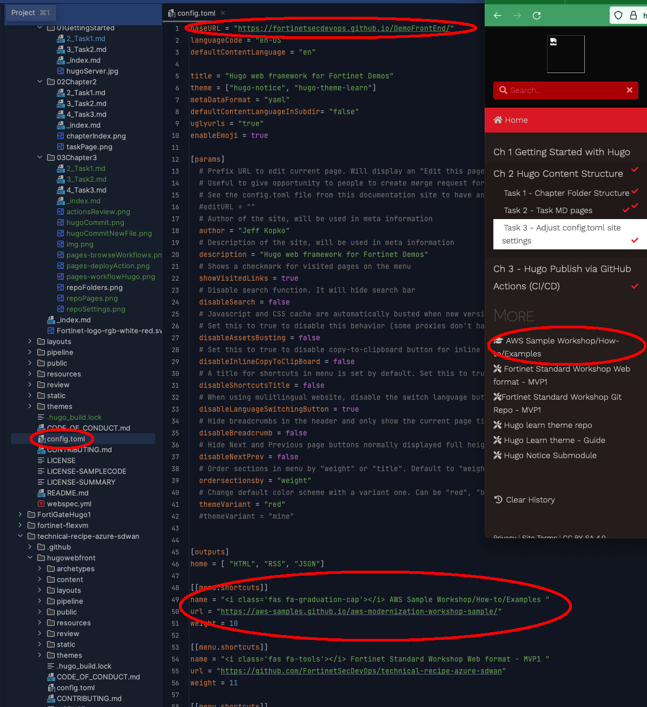

### Task 2 - Adjust the Site's [Frontmatter]("https://gohugo.io/content-management/front-matter/") in config.toml file 
{} Config.toml must be modified for each new repo as it controls overall parameters for the site {}
1. Open the **config.toml** file under the repo root to change a few parameters of the site
   * Edit the **baseUrl** to match the GitHub Page for your site (*you won't have this until you've done at least 1 GitHub action/build*)
   * Add information URL's to the bottom of the leftnav bar with **[[menu.shortcuts]]**
     * menu.shortcuts are displayed lowest to highest according to their weight
   * Additional customizations can be made with **themeVariants**, but they won't be covered here
   
