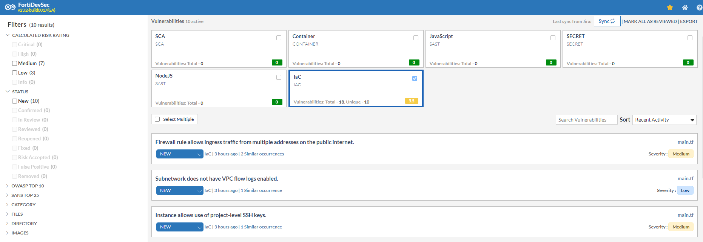
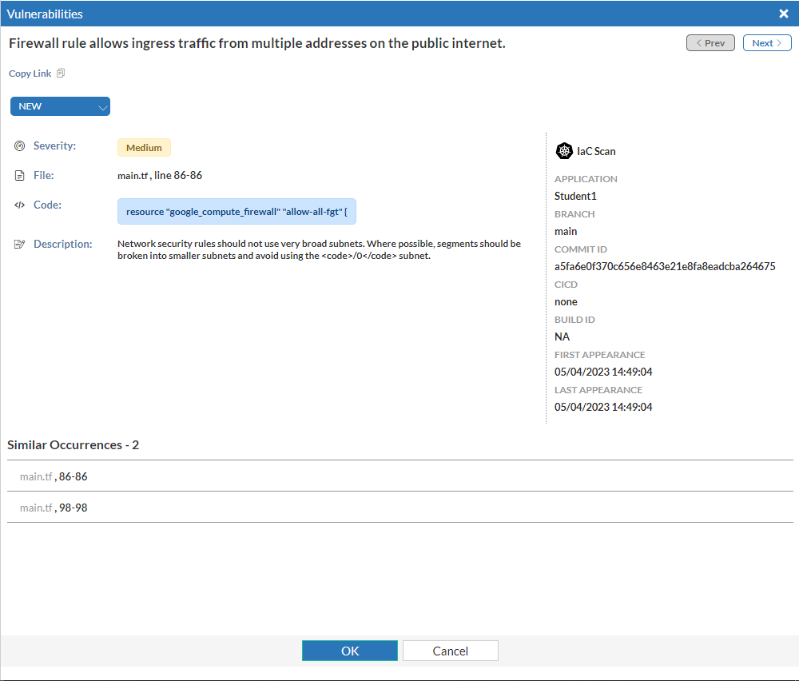
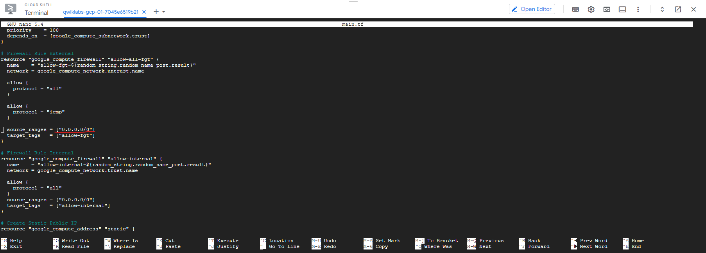
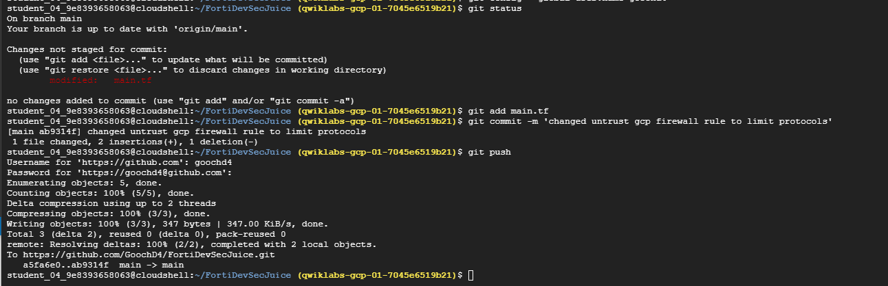

By clicking on the "Vulnerabilities" link in the IaC box, you can drill in to the issues found.  Note the filters on the left side of the screen and the sort functionality on the right.



1. **Let's dig into the vulnerability labeled as "Firewall rule allows ingress traffic from multiple addresses on the public internet" by clicking on it.  This will cause a pop up with more detail to appear on the right side of the screen.  From here we get more detail on the actual issue.  We can see that it was raised against main.tf, and that there are two occurrences of the error, and we are given the line numbers on which the errors can be found.**



1. **We can go back to our Google cloud shell and open the file to fix the error, using the "nano main.tf" command.  With nano open, we can type ctrl+shift+- this will open a prompt at the bottom of the screen.   Type the line number from the vulnerability and hit enter.  This will move your cursor to the appropriate line (86).  We can see that this is a firewall rule applied to the untrust network, which is allowing all protocols from all IP sources (0.0.0.0/0).**



1. **We have a couple of options.  We can either choose to accept the risk, or modify the code to limit the source IP addresses allowed.**

**Accept risk:**


**Modify Code:**
Change line 86 so that "source_ranges = ["1.2.3.4/32"]"  Once don the firewall rule should look like below:

```sh

# Firewall Rule External
resource "google_compute_firewall" "allow-all-fgt" {
  name    = "allow-fgt-${random_string.random_name_post.result}"
  network = google_compute_network.untrust.name

  allow {
    protocol = "all"
  }

  allow {
    protocol = "icmp"
  }

  source_ranges = ["1.2.3.4/32"]
  target_tags   = ["allow-fgt"]
}

```


1. **Now that we have made the modification, locally, we need to push it to our Github repository.  This will cause Github actions to deploy a docker host on ubuntu and run a scan against the application, ultimately reporting the results back to FortiDevSec.**

```sh

git status
git add main.tf
git commit -m 'changed untrust gcp firewall rule to limit protocols'
git push

```

The outputs should look something like this:



1. **Once the scan is complete, go back to FortiDevSec and check that the number of vulnerabilities is reduced and that the "Firewall rule allows ingress traffic from multiple addresses on the public internet" vulnerability is no longer present.**


  