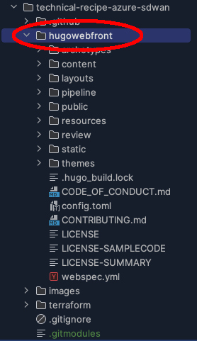

### Task 1 - Insert Hugo content into your Parent repo

1. We want to house the Hugo content close to the rest of your demo content (terraform/cloudformation/scripts/etc).  So all you have to do is copy your hugo content into your parent repo root directory
   * copy your entire Hugo folder **DemoFrontEnd** to the root of the repo you're using for your Demo.
   * Folder structure should look similar to the following:
   

  