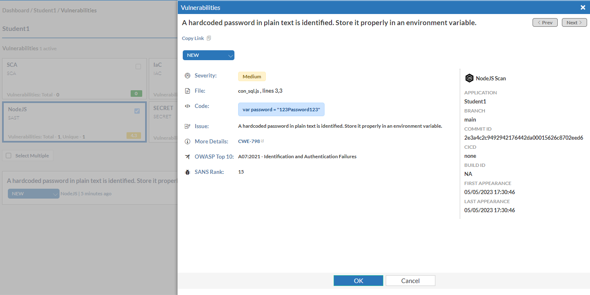

As we saw during the initial scan, the presence of the "con_sql.js" file instigated a NodeJS scan.  Initially, that did not return any errors.  Let's modify that file to add a vulnerability.

1. **Using nano add the below ling to the con_sql.js file.**

```sh

var password = "123Password123"

```

1. **Push the change to our Github repository.**

```sh

git status
git add con_sql.js
git commit -m 'added password to con_sql.js to trigger vulnerability'
git push

```
1. **After the push and subsequent scan is complete, you should notice a new vulnerability for NodeJS.




**Congratulations!  You have finished Lab 3.  You are now ready to proceed to Lab 4.**


